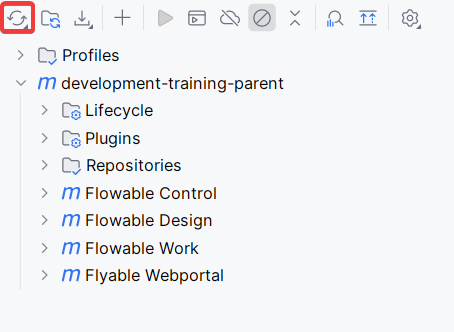
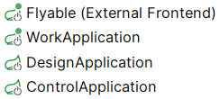
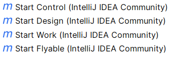
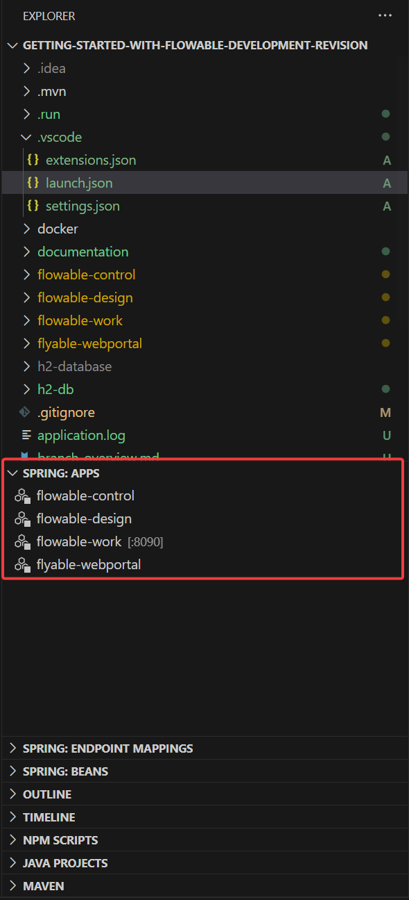

# Building & Running Project Artifacts

--- 
🚨🚨**Important**🚨🚨 

Follow this guide carefully, step by step, to ensure a smooth setup. No jumping ahead! 😉

----

1. **License File**  
   Copy the provided `flowable.license` file to a folder named `.flowable` in your home directory (e.g., `~/.flowable/`).

2. **Prerequisites**
   - **Java SDK:** Java 17 or newer is required for this setup.
   - **Maven Settings:** Copy the provided `settings.xml` into your `~/.m2/` directory. Example: `C:\Users\YourName\.m2\settings.xml` or `~/.m2/settings.xml` on macOS/Linux.  
   <br/>
     _If you don’t want to overwrite your current `settings.xml` or already mirror the Flowable artifacts, see the [Custom settings.xml](#optional-custom-settingsxml) section below._

3. **Build the Project**
   Sync/Reload your Maven project in your IDE (e.g., in IntelliJ, open the "Maven" panel and click the following icon):<br/>
   <br/>
   Some IDEs such as IntelliJ IDEA may do this automatically.

---

## Starting the Applications

- **IntelliJ IDEA Ultimate:** Use the provided Spring Boot configurations.  
  

- **IntelliJ IDEA (without Ultimate subscription, formerly known as "Community Edition"):** Use the Maven configurations. IntelliJ IDEA without an Ultimate subscription doesn’t support Spring Boot configs directly.  
  

- **Visual Studio Code:**  
  Run the applications via the provided `launch.json` or install the Spring Boot Extension Pack.  
  

When running, check these endpoints:
- [http://localhost:8090](http://localhost:8090) – Flowable Work
- [http://localhost:8091](http://localhost:8091) – Flowable Design
- [http://localhost:8092](http://localhost:8092) – Flowable Control (optional)
- [http://localhost:8093](http://localhost:8093) – Flyable Booking Portal (optional)

> **Quick Tip:** If Flowable Work and Design are running, you’re set. Just log in with admin/test and you're good to go.

> **Windows Users:** If you see the "Command line is too long" error (common with IntelliJ IDEA), check the [Common issues](#common-issues) section.

---

## User Credentials

| User                   | Role           | Login  | Password |
|------------------------|----------------|--------|----------|
| Flowable Administrator | Flowable-Admin | admin  | test     |
| User 1                 | Flowable-User  | user_1 | training |
| User 2                 | Flowable-User  | user_2 | training |

---

# Optional Additional Information

_(You can skip this section if you’re in a hurry.)_

## Optional: Custom settings.xml
Many organizations use a custom `settings.xml` file for Maven and may already have the Flowable artifacts in their repository. In that case, you don't need to overwrite the settings or do anything.

If your organization does not (yet) mirror the Flowable artifacts and you prefer not to overwrite your own `settings.xml`, copy your username (e.g. tra-0090-bot) and password into the `settings-flowable.xml` located in the project root.
> **Warning:** Storing passwords in plain text isn’t recommended. See [Maven's guide on password encryption](https://maven.apache.org/guides/mini/guide-encryption.html).

Build using:
```sh
mvn -s settings-flowable.xml clean package
```

## Optional: Running Flowable with a Database & Elasticsearch

For a more production-ready setup, use a dedicated Postgres and Elasticsearch setup instead of the default H2 database.

1. **Activate Profiles:**  
   Enable the `postgres` and `elastic` profiles:
   ```sh
   spring.profiles.active=postgres,elastic
   ```

2. **Docker Setup:**  
   The simplest way to set up the necessary services is with Docker:
   ```sh
   cd ./docker/
   docker compose up
   ```

3. **Recreating Containers:**
   - To stop and remove containers:
     ```sh
     cd ./docker
     docker compose down
     ```
   - To remove Docker volumes (data persistence for the database and Elasticsearch), run:
     ```sh
     cd ./docker
     docker compose down -v
     ```
     **WARNING:** This deletes all stored data.

## Custom Components
Developing and uploading custom form components (such as the Credit Card widget) requires additional frontend tooling.
If you are attending a backend-focused training, you do not need to do any of this.

Setup is covered in two separate guides:

1. **[Frontend Environment Setup](./documentation/custom-components-setup.md)**  
   Install Node, Yarn, the Flowable CLI, and authenticate against Artifactory and your local Flowable Design instance.

2. **[Creating a Component](./documentation/custom-components-development.md)**  
   Initialise a component library, scaffold the Credit Card component, run the live-reload dev server, and publish.


## Common Issues

### Command Line is Too Long (Windows)
If you see the error “Command line is too long” in IntelliJ IDEA on Windows, click the **Shorten Command Line** button at the bottom left or update the "Shorten commandline" option in the Spring Boot run configuration.

### npm install Problems
Running `mvn install` may trigger the Flyable Booking Portal to install frontend dependencies. In most cases, this isn’t necessary since the project auto-builds on import. Check the optional details if you need to run it manually.

