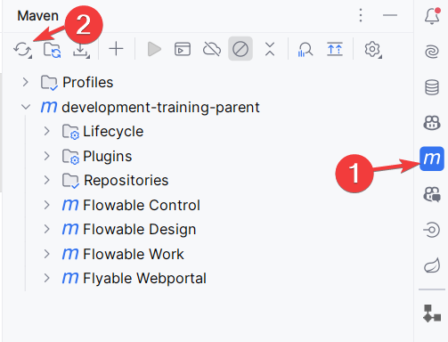

# Building & Running Project Artifacts

1. **License File**  
   Copy the provided `flowable.license` file to a folder named `.flowable` in your home directory (e.g., `~/.flowable/`).

2. **Prerequisites**
   - **Java and Maven:** Ensure these are installed.
   - **Maven Settings:** Copy the provided `settings.xml` into your `~/.m2/` directory.  
     _If you don’t want to overwrite your current file, see the [Custom settings.xml](#custom-settingsxml) section below._

3. **Build the Project**
   Sync/Reload your Maven project in your IDE (e.g., in IntelliJ, open the "Maven" panel and click the following icon):
   <br/>
   This should usually happen automatically.

---

## Starting the Applications

- **IntelliJ IDEA Ultimate:** Use the provided Spring Boot configurations.  
  

- **IntelliJ IDEA Community:** Use the Maven configurations (Community Edition doesn’t support Spring Boot configs directly).  
  

- **Visual Studio Code:**  
  Run the applications via the provided `launch.json` or install the Spring Boot Extension Pack.  
  

When running, check these endpoints:
- [http://localhost:8090](http://localhost:8090) – Flowable Work
- [http://localhost:8091](http://localhost:8091) – Flowable Design
- [http://localhost:8092](http://localhost:8092) – Flowable Control (optional)
- [http://localhost:8093](http://localhost:8093) – Flyable Webportal (optional)

> **Quick Tip:** If Flowable Work and Design are running, you’re set. Just log in with admin/test and you're good to go.

> **Windows Users:** If you see the "Command line is too long" error (common with IntelliJ IDEA), check the [Common issues](#common-issues) section.

---

## User Credentials

| User                   | Role           | Login  | Password |
|------------------------|----------------|--------|----------|
| Flowable Administrator | Flowable-Admin | admin  | test     |
| User 1                 | Flowable-User  | user_1 | training |
| User 2                 | Flowable-User  | user_2 | training |

---

# Optional Additional Information

_(You can skip this section if you’re in a hurry.)_

## Optional: Custom settings.xml

If you prefer not to overwrite your own `settings.xml`, copy your username and password into the provided `settings-flowable.xml` (located in the project root).
> **Warning:** Storing passwords in plain text isn’t recommended. See [Maven's guide on password encryption](https://maven.apache.org/guides/mini/guide-encryption.html).

Build using:
```sh
mvn -s settings-flowable.xml clean package
```

## Optional: Running Flowable with a Database & Elasticsearch

For a more production-ready setup, use a dedicated Postgres and Elasticsearch setup instead of the default H2 database.

1. **Activate Profiles:**  
   Enable the `postgres` and `elastic` profiles:
   ```sh
   spring.profiles.active=postgres,elastic
   ```

2. **Docker Setup:**  
   The simplest way to set up the necessary services is with Docker:
   ```sh
   cd ./docker/
   docker compose up
   ```

3. **Recreating Containers:**
   - To stop and remove containers:
     ```sh
     cd ./docker
     docker compose down
     ```
   - To remove Docker volumes (data persistence for the database and Elasticsearch), run:
     ```sh
     cd ./docker
     docker compose down -v
     ```
     **WARNING:** This deletes all stored data.

## Common Issues

### Command Line is Too Long (Windows)
If you see the error “Command line is too long” in IntelliJ IDEA on Windows, click the **Shorten Command Line** button at the bottom left or update the "Shorten commandline" option in the Spring Boot run configuration.

### npm install Problems
Running `mvn install` may trigger the Flyable Webportal to install frontend dependencies. In most cases, this isn’t necessary since the project auto-builds on import. Check the optional details if you need to run it manually.

