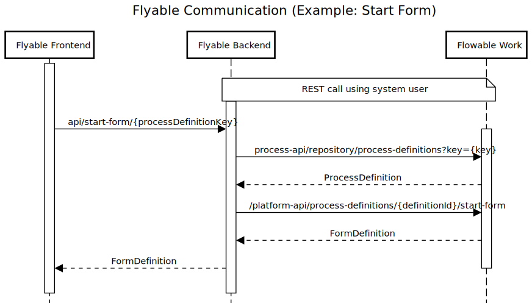

# Flyable Booking Portal

## Introduction
The **Flyable Booking Portal** is an example application demonstrating how to integrate a custom **React + Vite** frontend with a **Flowable Work** backend.
It showcases:

- A **custom frontend** built with **React and Vite**
- Integration with **Flowable Forms React components**
- A **custom-built wizard** illustrating how to create custom forms and submit them to Flowable to start a process
- **Generic task and process lists** displaying Flowable data
- The ability to **start new generic process instances**
- A **backend** that relays API calls to a Flowable Work application

---

For any issues or questions, refer to the documentation or contact `training@flowable.com`.

## Architecture
The application consists of two main components:

- **Backend**: A **Spring Boot** application (`FlyableWebportalApplication`)
- **Frontend**: A **React + Vite** application

The backend handles **authentication/authorization** and relays API calls to a **Flowable Work** application. The frontend does not communicate directly with Flowable; instead, all requests are routed through the backend for authentication, security, and API management.

The following diagram illustrates a typical API call sequence:



## Prerequisites
Before running the application, ensure you meet the following requirements:

- **Java 17 or higher** (required for the Spring Boot backend)
- **Maven** (for building and running the backend)
- **Node.js 22** (if running the frontend in development mode, this is downloaded locally when using the `frontend` profile, so no need to install it globally)
- **Access to Flowable frontend dependencies** (see details below)

## Quick Start / TL;DR
If you only plan to use the **Flyable Booking Portal** without modifying the frontend, follow these steps:

1. Ensure you have Java and Maven installed.
2. Run the Spring Boot application:

   ```sh
   ./mvnw spring-boot:run
   ```

The pre-built frontend bundle is available in `src/main/resources/static`, so you don’t need to build it separately.

If you're only using the **Flyable Booking Portal** without modifying the frontend, you don’t need to follow the next steps.

## Building and Running the Frontend
If you want to build and run the frontend, e.g., because you have made changes to it, you need access to the Flowable frontend dependencies. These are not available through the standard npm registry.

### Setting Up Access to Flowable Dependencies
To access **Flowable Forms** packages, update the `.npmrc` file in the `frontend` folder with the credentials provided by the Flowable training team.

If you already have access to the Flowable artifacts, you can remove the `.npmrc` file instead:

```sh
rm frontend/.npmrc
```

### Running the Backend with the Frontend Profile
When using the `frontend` profile, **Node.js 22 is downloaded locally for the project**, so no global installation is needed.
Start the application in development mode with:

```sh
./mvnw spring-boot:run -Pfrontend
```

### Running the Frontend Separately
To run the frontend independently, follow these steps:

1. Install dependencies (requires `.npmrc` file for Flowable frontend dependencies, see above):

   ```sh
   cd frontend
   npm install
   ```

2. Make your desired changes and start the frontend in development mode:

   ```sh
   cd frontend
   npm run dev
   ```

   This will start the frontend on `http://localhost:3000`.

---

Now you’re ready to work with the **Flyable Booking Portal**!

